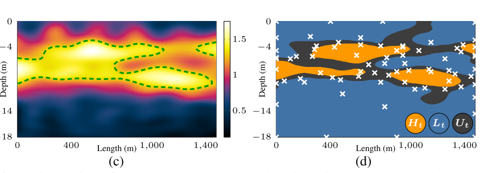
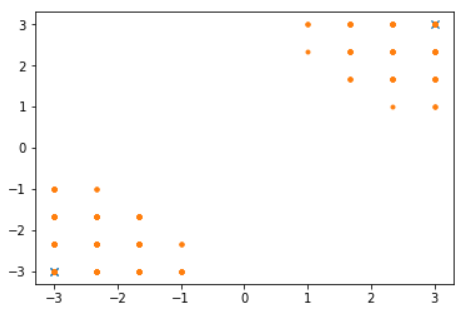
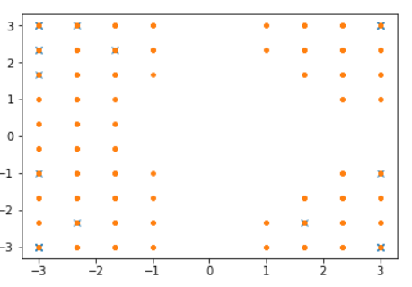

# 杨晨宇毕设进展 2020-03-15

## 思路:

构建一个 toy environment, 尝试学习CBF的算法

## 现状:

### Toy environment:

是一个平面物体移动的模型，物体的状态是 $s =\left[\begin{array}c x\\y \\ v_x \\v_y \end{array}\right]$, 动作空间是$\left[\begin{array}c f_{x} \\ f_{y}  \end{array}\right]$

任务就是让物体移动到指定位置，但是途中要避免障碍物

### Safe Set Estimation

所以所谓的"安全状态"，就是能够让物体可以不碰障碍物的状态。

我用了一个优化器(`scipy.minimize`)来判定这个状态是否安全

**优化的目标函数**

$$
\max_{u(t)} \min_{c,t}  d(p(u,t),p_c) - r_c
$$

就是最大化最小距离，其中$p$代表位置， $p_{c},r_{c}$代表障碍物$c$的位置和半径， $d$代表距离， $u(t)$代表输入动作

所以如果这个最优解大于0，那么这个状态是"安全"的，如果小于0, 那么这个就不是。

**采样判断安全集**

有了"安全"状态的判定方法之后，下一步是判断 "安全状态"构成的集合。 这里我采用的是"level set estimation"

> [Level set estimation][1] 论文中的图， 其中左边是真实的，右边是预测的。这个问题在于，每一次采样（对应我们跑一次优化问题）的开销很高，所以要尽可能减少采样次数地估计水平集. 

## 接下来的计划

**计算barrier function**

根据已经得到的level set，设计一个算法来得到level set的解析表达，还没有仔细研究过，我觉得SVM应该就可以。

**设计CBF-QP**
这是一个现成的算法，就是选取$u$ 使得$u$ 满足CBF的barrier的安全特性，同时输入的能量最小

## 目前遇到的问题

**优化器的结果不能找到最优解**。因为问题不是凸的，到后面的机器人的状态后，更不能保证得到凸的问题，所以优化器不能得到最优解。优化器得不到最优解就会导致 level set estimation的时候过于保守，目前我可以使用一些启发式的初始化方法来增加优化器得到最优解的可能性

**Level Set Estimation 的找点过程有些奇怪**。如下图是我实现的LSE的检测点的过程

> Level Set Estimation的找点示意, x,y 方向代表 状态空间的$x,y$, (0,0)处有一个半径为1的圆形障碍区域没有显示, 蓝色叉叉代表测试了的点，黄色点点代表完成判断了的点。前后两张图分别是运行算法第五轮以及运行算法第25轮选取的点。（叉叉的数目不够选点的次数，是因为叉叉只有x,y空间，在速度维度是重合了的）

我觉得我复现得还有一些bug，因为我想象中找点会很快找到中间去，然后再在不确定的边缘处取点，然而目前的算法好像只在边上取点。在中间的点一个都没有。

一个可能的原因是速度因素，由于我这次实验设置的$u$的范围比较小，所以（3,3,-3,-3）是危险的状态,而(3，3，0,0)是安全的，所以算法也是在最不确定的交界处找点。我后面应该很快就能解决这个问题

**Kernel 的选取** 

由于我们后面要拟合CBF（假设用SVM），所以应该CBF就要使用一些kernel。 同时，CBF还应该满足一些控制系统方面的性质，而这我还没有仔细研究过。

## Reference

[1]:Kim, D., Di Carlo, J., Katz, B., Bledt, G., & Kim, S. (2019). Highly Dynamic Quadruped Locomotion via Whole-Body Impulse Control and Model Predictive Control. Retrieved from http://arxiv.org/abs/1909.06586